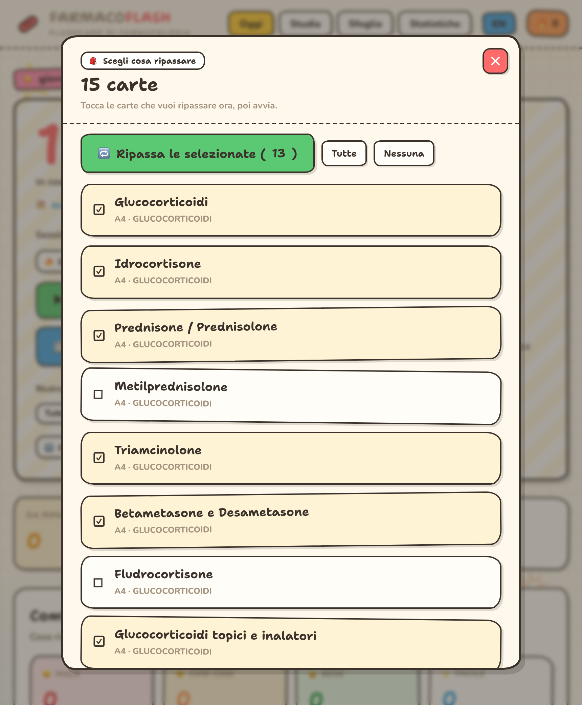
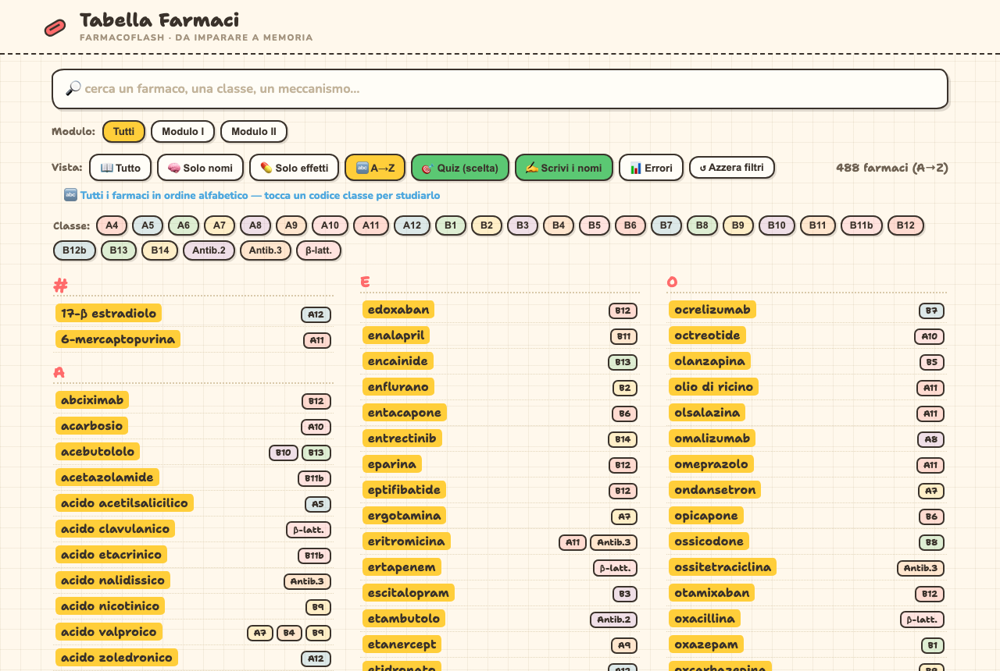

# 💊 FarmacoFlash

🇬🇧 English (this file) · 🇮🇹 **[Versione italiana → README.md](README.md)**

**Pharmacology flashcards that actually make things stick.** You study cards, say whether you knew them, and the app brings back the ones you forget at the right time — until they stay. All in **one file**, works **offline**, your data stays **only on your device**.

> 214 cards · 28 decks · extracted from lecture notes (Modules I–II) · every card has an **in-depth note** verified against *Goodman & Gilman, 14th ed.* (and PubMed)

---

## 🚀 How to use it (in plain words)

1. **Open the app.** Tap the 💊 icon. You start on the **Today** screen.
2. **Press ▶ Start.** A **drug name** appears: think of the answer.
3. **Flip the card.** Tap the screen: the explanation shows up.
4. **Say how it went** with a face — the app decides **on its own** when to show it again:
   - 😖 **Again** (didn't know it) → comes back **now**
   - 😐 **Hard** → comes back **soon**
   - 😄 **Good** → in **a few days**
   - 🌟 **Easy** → in **a long time**

   👉 Do a few cards **every day**: that's how the memory forms.
5. **Choose what to study** (**Session** box): **Both** · **🆕 New only** · **🔁 Review only** · **🔥 Hard** (the cards you miss most). 👉 Want to **hand-pick** them? Tap the **yellow box** at the top (**🗂 choose which to review**): tick only the cards you want and start just **those**.
6. **Fix mistakes precisely:** on **Today**, under *“How it went today”*, **tap a face** (e.g. 😐) → see exactly those cards → **Review these**. In **Stats** you'll find **🔥 At risk** and **🌱 Never mature**.
7. **Search a drug:** tap **Browse** and type a name (or a mechanism, an effect). Tap a card to read it.
8. **Memorize the names:** tap **📋 Names table**. Four views: **All** · **🧠 Names only** (tap → see *what it's for*) · **💊 Effects only** (read effects → guess the drug) · **🔤 A→Z** (every drug alphabetically). Every row shows **all the real drug names** (yellow chips): tap one → its study card opens. **Train with the name quiz:** **🎯 Quiz (choice)** or **✍️ Type the names** (fixes typos, always asks for **new** names, you can go **← Back**); **📊 Mistakes** collects the names you miss most for targeted review.
9. **See your progress:** **Stats** (how much you remember, your **streak** 🔥).
10. **Switch language** with the **IT/EN** button at the top.
11. **Don't lose progress:** *Stats › **⬇ Export backup***. On another device: **⬆ Import**.

## 📲 Install it as an app (offline)

Works **without internet**, no account, no subscription — your data stays on the device.

- **iPhone:** get the file (e.g. AirDrop), open it in **Safari** → **Share** → **Add to Home Screen**. The 💊 icon appears: open it like any app.
- **Android / desktop (Chrome):** open the file → **⋮** menu → **Install app**.

> The two apps are **linked**: from the **Table** tap a drug → its **study card** opens; from **Today**, the **📋 Names table** button reopens the table. Keep them **in the same folder**.

---

## 📸 What you can do

| Today | Study: flip the card | Answer + you rate it |
|---|---|---|
|  |  |  |

| Browse & search | Stats + “Reinforce” | Targeted review 🔥 |
|---|---|---|
|  |  |  |

| Review today's mistakes | Hand-drawn mechanism diagrams |
|---|---|
|  |  |

**Hand-pick what to review** — tap the yellow box and tick the cards:

|  |
|:--:|

**Names table** — to memorize, in three modes:

| All | 🧠 Names only (→ what it's for) | 💊 Effects only (→ guess) |
|---|---|---|
|  |  |  |

**All drugs A→Z (🔤)** — the full alphabetical index: tap a class code to study it.

|  |
|:--:|

**Name quiz** — to drill them in (it corrects you and never lets you repeat a name):

| ✍️ Type the names (fixes typos, reveals the whole class) | 📊 Your mistakes (targeted review over time) |
|---|---|
|  |  |

---

## ✨ Features in brief

- **Spaced repetition (SM-2, Anki-style)** — the app schedules each card for you.
- **Tailored sessions** — new / review / both / **🔥 hard**; new-per-day; **🔀 shuffle**.
- **Surgical review** — open *exactly* the cards you got wrong (from today's faces and Stats).
- **Memo-line** + **in-depth note 📘** verified against *Goodman & Gilman 14th ed.* (PMIDs cited).
- **30 hand-drawn mechanism diagrams** on 43 key cards.
- **Browse & full-text search**, **Names table** (search/filters/3 study modes, linked to cards), **Stats** (retention, streak, cards to reinforce).
- **Name quiz** (in the table) — **multiple-choice** or **type-in**: fixes typos, never accepts an already-used name (always new), **← Back / Next →** navigation, and a persistent **mistakes log** 📊 for targeted review.
- **Bilingual IT / EN**, **backup** export/import, **installable offline** PWA, private.

## 🔒 Privacy

Private repo. Study data lives **only in your browser/device** (no server, no account). Use **Export/Import** to move it.
⚠️ Free GitHub Pages is **public** even for a private repo: the included Pages workflow is **manual** and never runs on its own.

## 🛠️ Rebuild (developers)

```bash
node build/build.js          # → Flashcard-Farmacologia.html
node build/_gen-table.js     # → Tabella-Farmaci.html
```

🤖 Built with [Claude Code](https://claude.com/claude-code)
