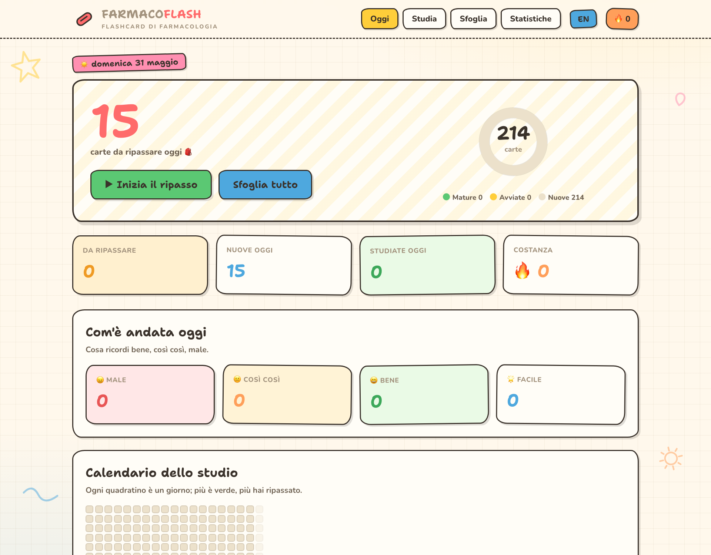
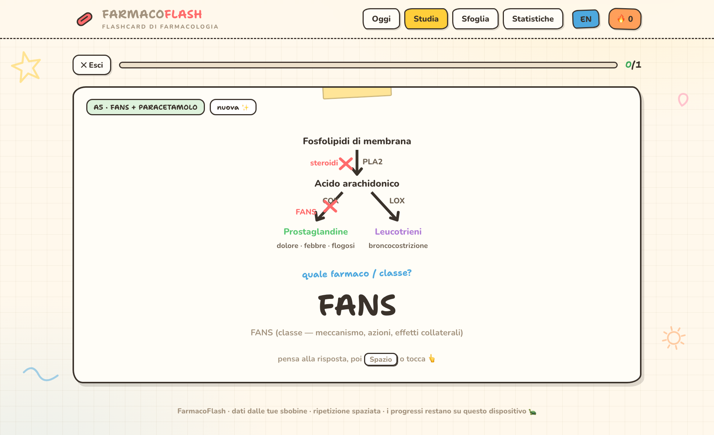
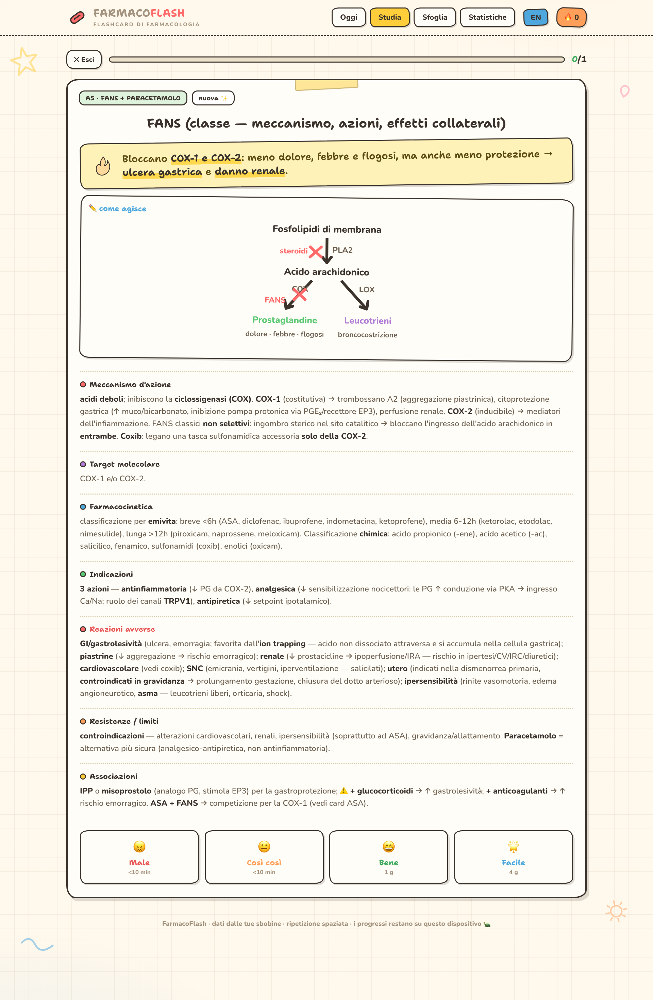
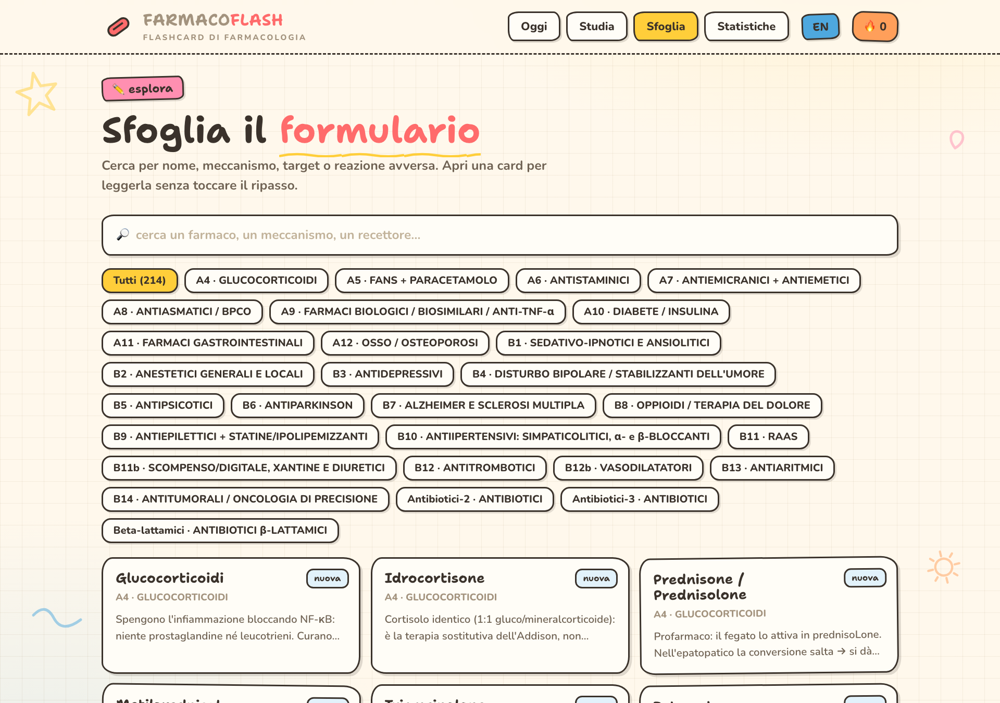
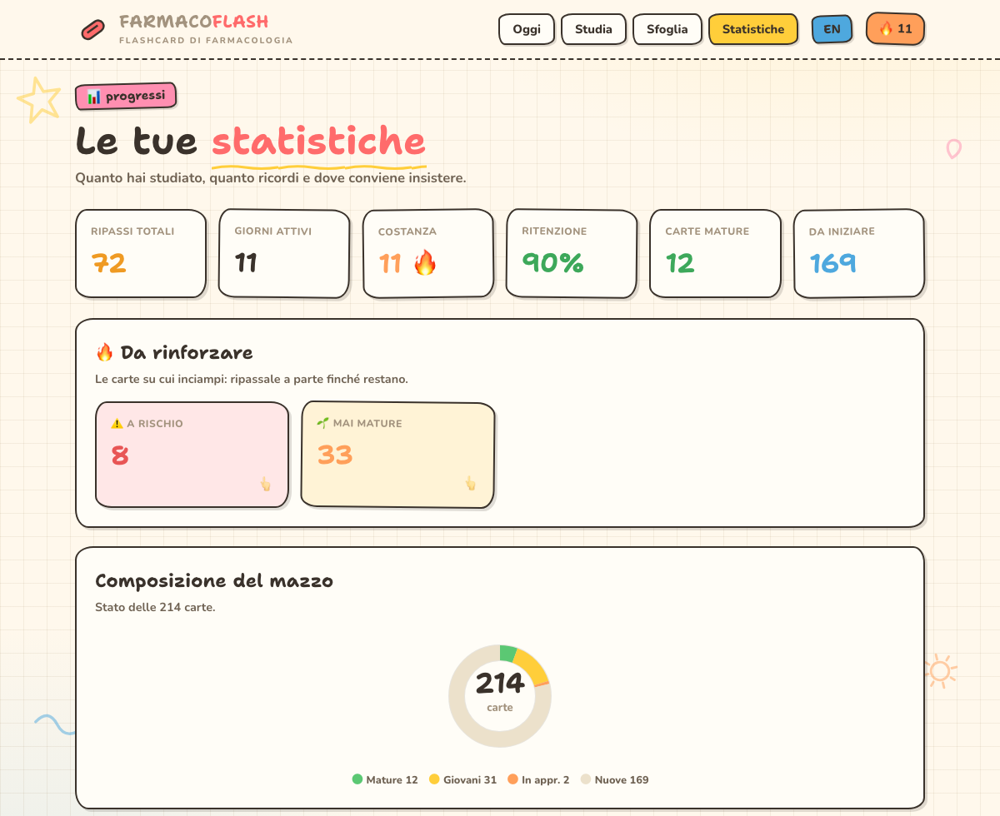
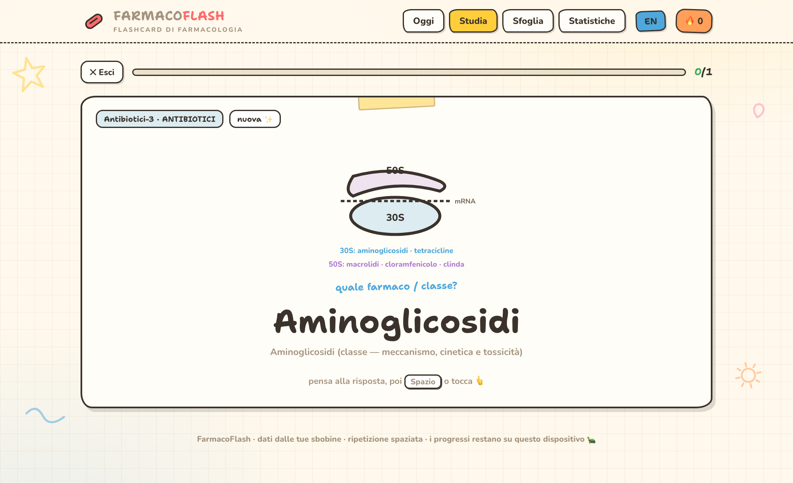
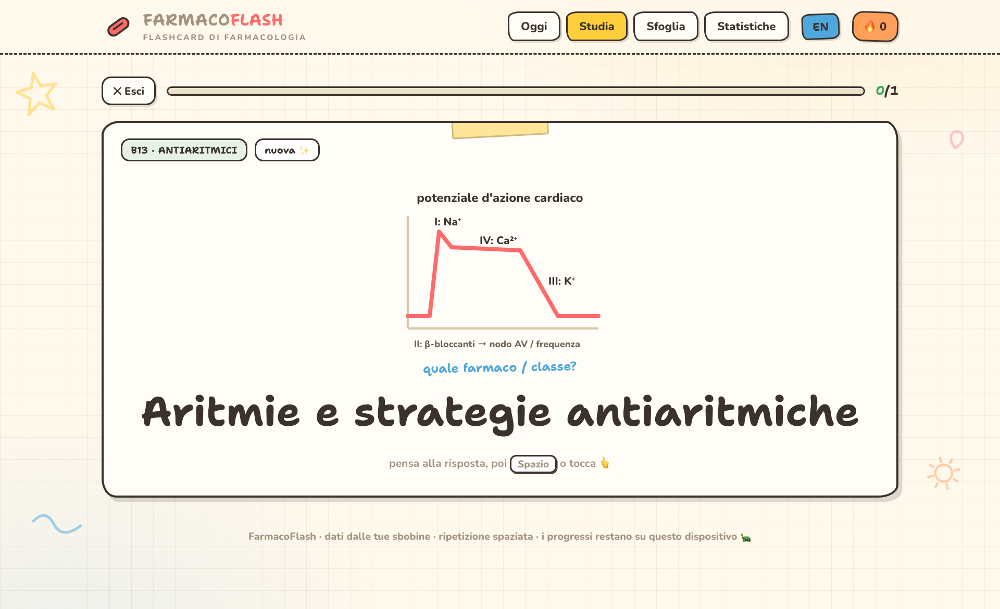
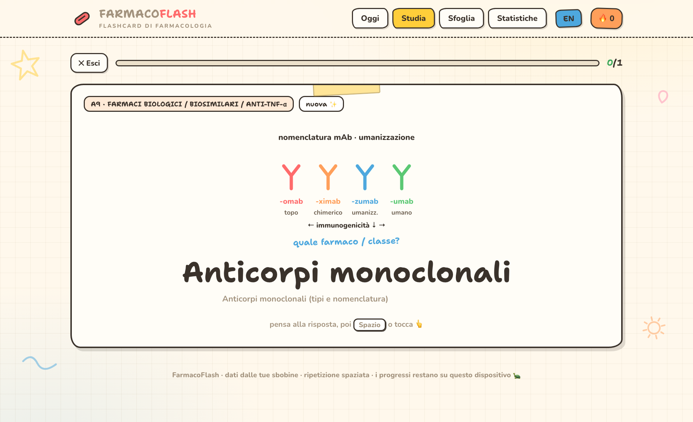
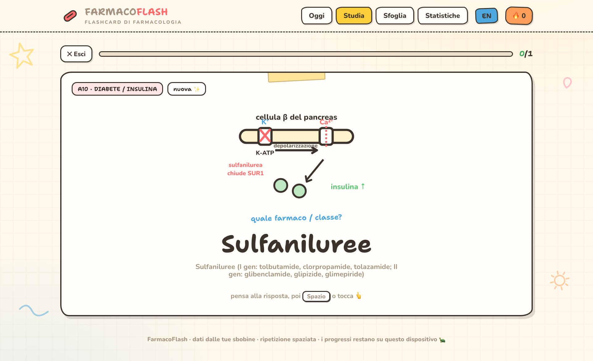

# 💊 FarmacoFlash

🇬🇧 English (this file) · 🇮🇹 **[Versione italiana → README.md](README.md)**

**Interactive pharmacology flashcards** — spaced repetition, punchy memo-lines and hand-drawn explanatory diagrams. All in **a single HTML file**, works **offline**, progress stays on your device. Switch the interface and all content between **Italian and English** with the **IT/EN** toggle in the header.

> 214 cards · 28 decks · extracted from university lecture notes (Modules I–II) · every card carries a **source-verified in-depth note** from *Goodman & Gilman, 14th ed.* and **PubMed**

---

## 📸 Screenshots

| Today (dashboard) | Study — front with diagram | Full answer |
|---|---|---|
|  |  |  |

| Browse | Stats |
|---|---|
|  |  |

**Hand-drawn mechanism diagrams** (on 43 key cards):

| Antibiotics — 30S/50S ribosome | Antiarrhythmics — Vaughan-Williams | Antibodies — nomenclature | Diabetes — K-ATP channel |
|---|---|---|---|
|  |  |  |  |

> Screenshots show the Italian interface; tap **IT/EN** in the app for the full English version.

---

## ✨ Features

- **Bilingual (IT / EN)** — one toggle translates the whole interface, the cards (questions and answers), the memo-lines and the diagram labels.
- **Spaced repetition (SM-2, Anki-style)** — rate each card *Again / Hard / Good / Easy* and the app recomputes when to show it next.
- **Shuffle mode** 🔀 — a toggle to study cards in random order instead of deck order (plus a 🔀 button during a session to reshuffle on the fly).
- **Daily tracking** — how many cards you studied, how today went, a study-day heatmap, streak 🔥.
- **Punchy memo-line** on a sticky note — one sharp sentence per card that locks in the key idea.
- **In-depth note on every card** (📘) — a clinical, exam-focused note verified against *Goodman & Gilman, 14th ed.* and **PubMed** (PMIDs cited), separate from and complementary to the base answer.
- **Hand-drawn explanatory drawings** — one illustration per topic (synapse, nephron, bacterium, heart…) plus **30 mechanism diagrams on 43 key cards**: COX/eicosanoid cascade, K-ATP channel, GLUT4, AMPK, SGLT2, WHO pain ladder, μ receptor, GABA-A, RAAS, statins, haemostasis, anaesthesia triad, dopaminergic pathways, Vaughan-Williams classes, proton pump, PBP/β-lactams, 30S/50S ribosome, folate pathway, SSRI reuptake, diuretic sites, immune checkpoint, mAb nomenclature, Ambler classes, L-DOPA/carbidopa, heparin-ATIII, warfarin/VKOR, nitrates→NO, bisphosphonates, GLP-1 incretins, MAO/tyramine.
- **Browse & full-text search** by name, mechanism, target or adverse reaction.
- **Stats** — deck composition, mastery by topic, retention.
- **Backup** — export/import your progress as JSON.
- **Tuned for Safari / iPhone** — safe-area, no zoom on focus, *Add to Home Screen* as a web app.

## 🚀 How to use

1. Open **`Flashcard-Farmacologia.html`** with a double click (Safari/Chrome). Works offline.
2. On iPhone: AirDrop the file → open it in Safari → **Share › Add to Home Screen**.
3. Pick your language with the **IT/EN** button in the top bar (the choice is remembered).
4. Progress is saved in the browser. To move it to another device use **Export backup** in *Stats*, then **Import** on the other one.

### Deep links (handy for sharing / screenshots)
`…Flashcard-Farmacologia.html#dash` · `#browse` · `#stats` · `#card=<id>` · `#front=<id>`

## 🛠️ Build (regenerate the file)

```bash
node build/build.js
```

- `build/parse.js` → extracts the cards from the `.md` / `.rtf` sources into `build/cards.json`
- `build/memo/*.json` → the memo-lines
- `build/enrichments.json` (+ `enrichments-en.json`) → in-depth notes from Goodman & Gilman
- `build/i18n/en-*.json` + `diagrams-en.json` → the English translations (cards + diagrams)
- `build/app-template.html` → the app (CSS + JS + drawings) with the `__DATA_B64__` placeholder
- `build/build.js` → merges everything and writes `Flashcard-Farmacologia.html` (data injected as base64)

The English content is produced from the Italian sources and stored under `build/i18n/`; `build.js` merges it so each card carries both languages.

## 📁 Structure

```
Flashcard-Farmacologia.html     ← the ready app (single-file, offline, bilingual)
Flashcards_*.md / *.rtf         ← card sources (lecture notes)
build/                          ← parser, template, data, build scripts
  app-template.html  parse.js  build.js  cards.json
  memo/*.json        enrichments.json  enrichments-en.json
  i18n/              ← English translations (en-*.json, diagrams-en.json)
screenshots/                    ← images for this README
task_plan.md / notes.md         ← plan and working notes
```

## 📲 Open it anywhere (keeping the repo private)

- **Offline (recommended)** — open `Flashcard-Farmacologia.html` on the device; on iPhone *Share › Add to Home Screen*. No internet, no account.
- **Sync via the private repo** — on another computer:
  ```bash
  gh repo clone Mutablewarp/farmacoflash
  open "farmacoflash/Flashcard-Farmacologia.html"   # macOS
  ```
  to update: `git pull`. (Study *progress* stays local to the browser: use **Export/Import backup** to move it.)
- **GitHub Pages** — a workflow is included at `.github/workflows/pages.yml` (**manual** trigger). ⚠️ On a free plan a Pages site is **public** even for a private repo; a **private** site needs GitHub Pro/Team. That's why the workflow never runs on its own — it only publishes if you deliberately start it.

## ⚠️ Notes

- Material for **personal study use**. The memo-lines are mnemonic summaries; they do not replace the textbook or clinical judgement.
- Data extracted from the author's own lecture notes. Every card has an in-depth note with citations verified against *Goodman & Gilman, 14th ed.* and **PubMed** (PMIDs checked one by one; a few citations are contextual rather than direct; the *etifoxine* note cites the EMA SmPC). These remain study summaries — always verify against the textbook.

🤖 Built with [Claude Code](https://claude.com/claude-code)
