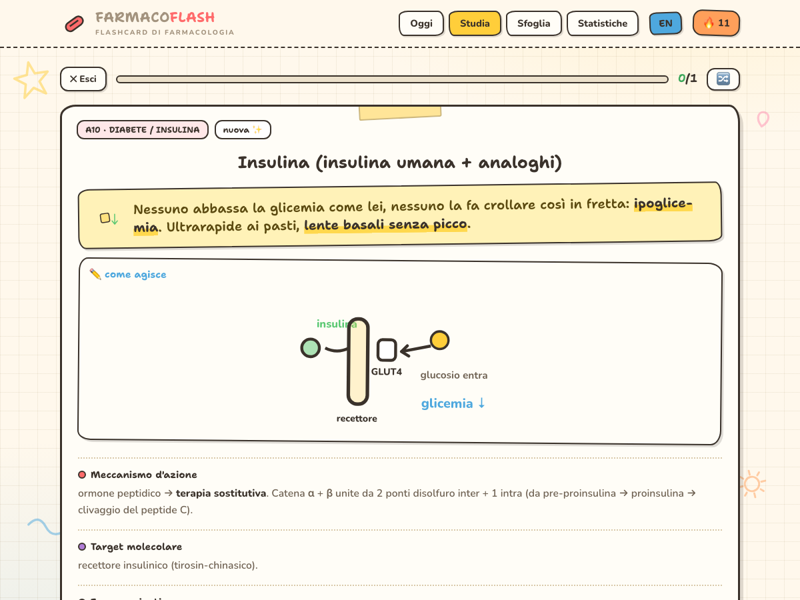
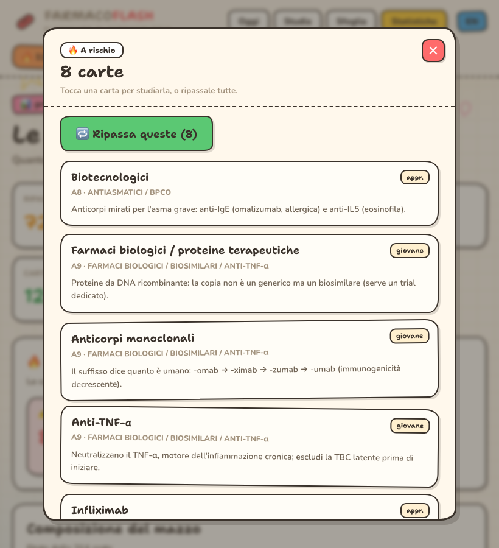
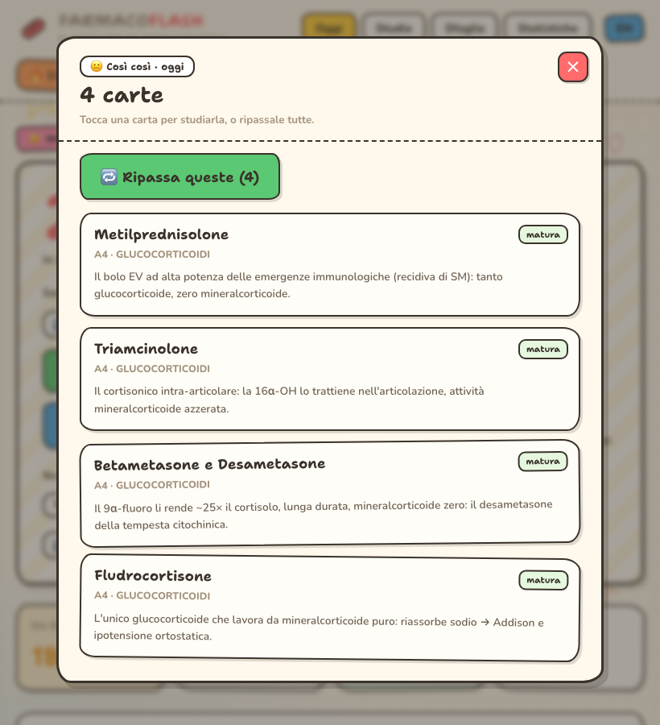
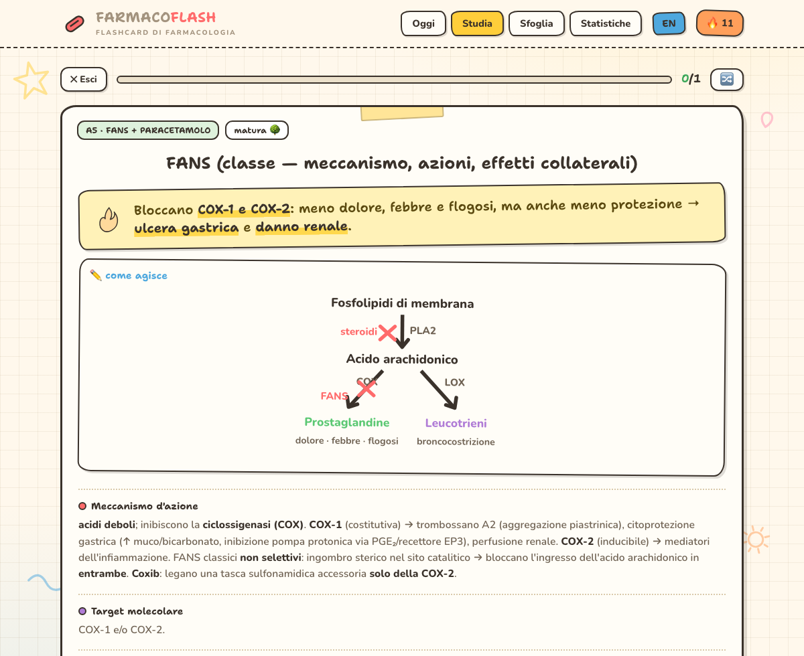
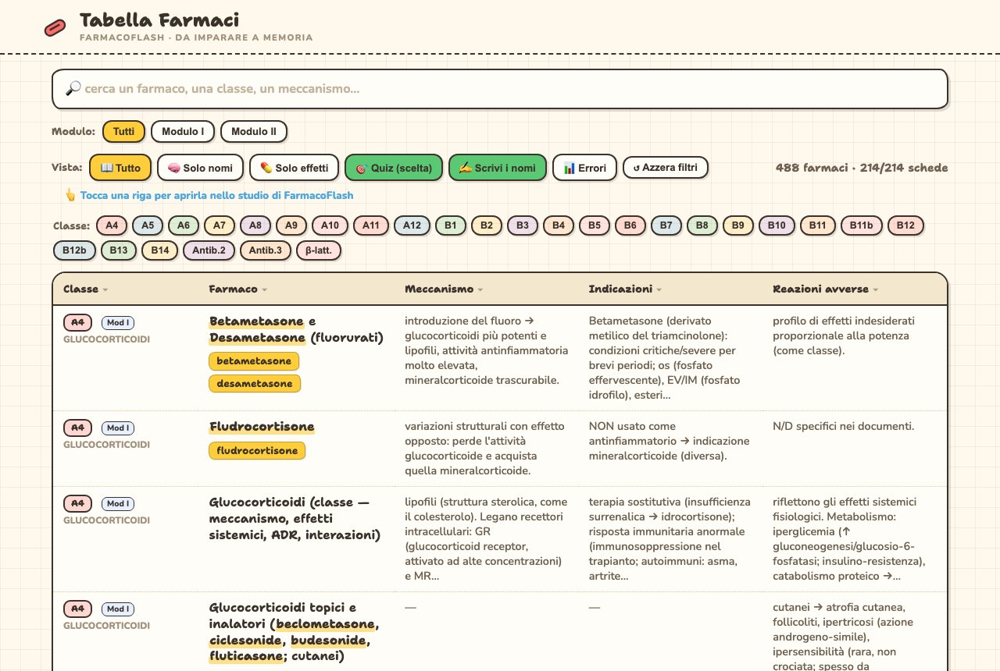
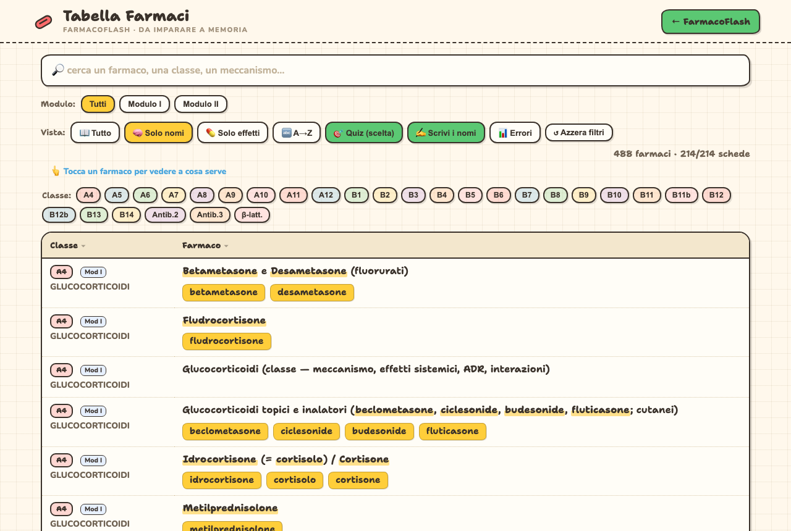
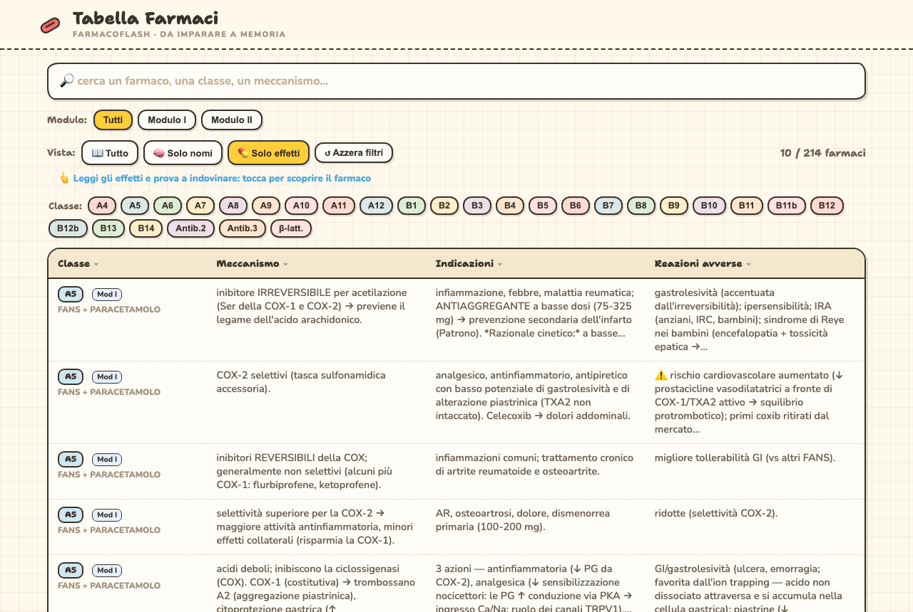
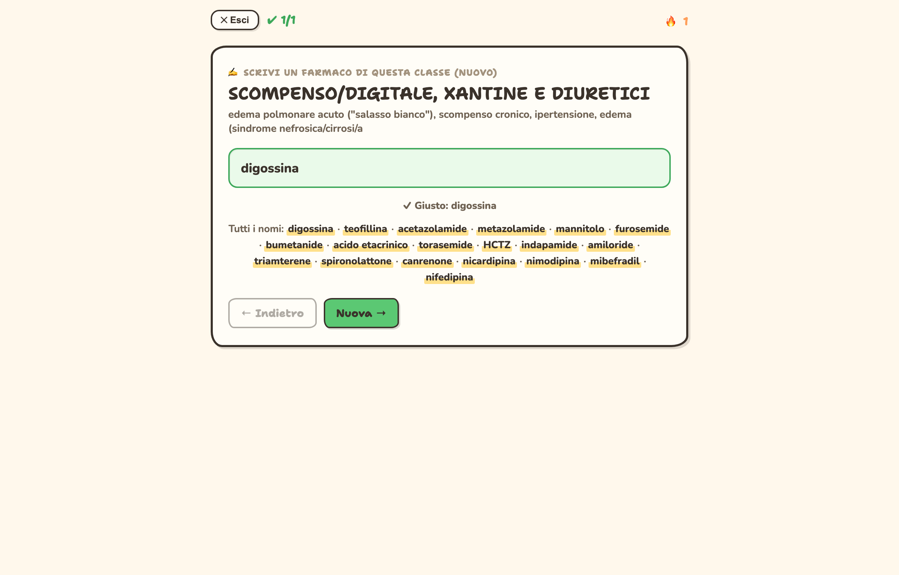
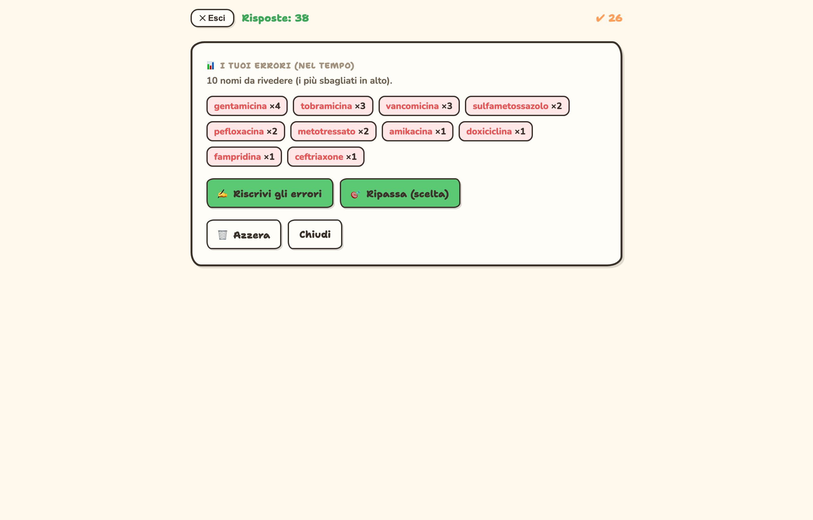

# 💊 FarmacoFlash

🇮🇹 Italiano (questo file) · 🇬🇧 **[English version → README.en.md](README.en.md)**

**Flashcard di Farmacologia che ti aiutano a ricordare davvero.** Studi le card, dici se le sai, e l'app ti rifà al momento giusto quelle che dimentichi — finché restano in testa. Tutto in **un unico file**, funziona **senza internet**, i tuoi dati restano **solo sul tuo dispositivo**.

> 214 card · 28 mazzi · estratte dalle sbobine (Moduli I–II) · ogni card ha un **approfondimento verificato** sul *Goodman & Gilman, 14ª ed.* (e PubMed)

---

## 🚀 Come si usa (in parole semplici)

1. **Apri l'app.** Tocca l'icona 💊. Parti dalla schermata **Oggi**.
2. **Premi ▶ Inizia.** Compare il **nome di un farmaco**: pensa alla risposta.
3. **Gira la card.** Tocca lo schermo: compare la spiegazione.
4. **Dì com'è andata** con un faccino — e l'app decide **da sola** quando rifartela:
   - 😖 **Male** (non la sapevi) → torna **subito**
   - 😐 **Così così** → torna **presto**
   - 😄 **Bene** → torna tra **qualche giorno**
   - 🌟 **Facile** → torna tra **molto tempo**

   👉 Fai un po' di card **ogni giorno**: è così che il ricordo si fissa.
5. **Scegli cosa studiare** (riquadro **Sessione**):
   **Entrambe** (nuove + ripasso) · **🆕 Solo nuove** · **🔁 Solo ripasso** · **🔥 Difficili** (le carte che sbagli di più).
6. **Rivedi gli errori in modo mirato:**
   - nella schermata **Oggi**, sotto *“Com'è andata oggi”*, **tocca un faccino** (es. 😐) → vedi **proprio quelle** carte → **Ripassa queste**;
   - in **Statistiche** trovi **🔥 A rischio** e **🌱 Mai mature**: toccale per ripassarle.
7. **Cerca un farmaco:** tocca **Sfoglia** e scrivi il nome (o un meccanismo, un effetto). Tocca una card per leggerla.
8. **Impara i nomi a memoria:** tocca **📋 Tabella dei nomi**. Tre modi:
   **Tutto** · **🧠 Solo nomi** (tocchi un nome → vedi *a cosa serve*) · **💊 Solo effetti** (leggi gli effetti → indovini il farmaco).
   Tocca un farmaco → si apre la sua **scheda di studio**.
   **Allenati con il quiz dei nomi:** **🎯 Quiz (scelta)** oppure **✍️ Scrivi i nomi** (ti corregge i refusi, ti chiede sempre nomi **nuovi**, puoi tornare **← Indietro**). **📊 Errori** raccoglie i nomi che sbagli di più, per ripassarli a colpo sicuro.
9. **Guarda i tuoi progressi:** **Statistiche** (quanto ricordi, la tua **costanza** 🔥).
10. **Cambia lingua** con il pulsante **IT/EN** in alto.
11. **Non perdere i progressi:** *Statistiche › **⬇ Esporta backup*** (salva un file). Su un altro dispositivo: **⬆ Importa**.

## 📲 Installala come app sul telefono (offline)

Funziona **senza internet**, senza account, senza abbonamenti — i tuoi dati restano sul telefono.

- **iPhone:** ricevi il file (es. AirDrop), aprilo in **Safari** → **Condividi** → **Aggiungi a Home**. Comparirà l'icona 💊: aprila come una normale app.
- **Android / computer (Chrome):** apri il file → menù **⋮** → **Installa app**.

> Le due app sono **collegate**: dalla **Tabella** tocchi un farmaco → si apre la sua **scheda di studio**; dalla schermata **Oggi**, il pulsante **📋 Tabella dei nomi** riapre la tabella. Tienile **nella stessa cartella**.

---

## 📸 Cosa puoi fare

| Oggi (la tua giornata) | Studio: gira la card | Risposta + valuti |
|---|---|---|
|  |  |  |

| Sfoglia & cerca | Statistiche + “Da rinforzare” | Ripasso mirato 🔥 |
|---|---|---|
|  |  |  |

| Rivedi gli errori del giorno | Diagrammi del meccanismo (disegnati a mano) |
|---|---|
|  |  |

**Tabella dei nomi** — per memorizzare, in tre modi:

| Tutto | 🧠 Solo nomi (→ a cosa serve) | 💊 Solo effetti (→ indovina) |
|---|---|---|
|  |  |  |

**Quiz dei nomi** — per impararli a memoria (ti corregge e non ti fa ripetere i nomi):

| ✍️ Scrivi i nomi (corregge i refusi, svela tutta la classe) | 📊 I tuoi errori (ripasso mirato nel tempo) |
|---|---|
|  |  |

---

## ✨ Funzioni in breve

- **Ripetizione spaziata (SM-2, stile Anki)** — l'app calcola da sola quando rivedere ogni card.
- **Sessioni su misura** — nuove / ripasso / entrambe / **🔥 difficili**; quante nuove al giorno; **🔀 ordine casuale**.
- **Ripasso chirurgico** — apri *esattamente* le carte sbagliate (dai faccini di “oggi” e dalle Statistiche).
- **Memofrase** su post-it + **approfondimento 📘** verificato su *Goodman & Gilman 14ª ed.* (PMID citati).
- **30 diagrammi-meccanismo disegnati a mano** su 43 card chiave (COX/eicosanoidi, K-ATP, GLUT4, RAAS, Vaughan-Williams, ribosoma 30S/50S, μ-recettore, GABA-A, statine, eparina/warfarin…).
- **Sfoglia & cerca** per nome, meccanismo, target, reazione avversa.
- **Tabella dei nomi** con ricerca, filtri e 3 viste di studio, collegata alle schede.
- **Quiz dei nomi** (nella tabella) — a **scelta multipla** o **a digitazione**: corregge i refusi, non accetta nomi già usati (sempre nomi nuovi), navigazione **← Indietro / Nuova →**, e **storico degli errori** 📊 per il ripasso mirato.
- **Statistiche** — ritenzione, costanza 🔥, carte mature, **carte da rinforzare**.
- **Bilingue IT / EN** (interfaccia, domande, risposte, diagrammi).
- **Backup** export/import in JSON · **app installabile offline**, privata.

---

## 🔒 Privacy

Repo **privato**. I dati di studio vivono **solo nel tuo browser/telefono** (nessun server, nessun account). Per spostarli usa **Esporta/Importa backup**.
⚠️ GitHub Pages su piano gratuito è **pubblico** anche con repo privato: il workflow Pages incluso è **manuale** e non parte da solo.

## 🛠️ Rigenerare l'app (per sviluppatori)

```bash
node build/build.js          # → Flashcard-Farmacologia.html
node build/_gen-table.js     # → Tabella-Farmaci.html
```

`build/`: `app-template.html`, `table-template.html`, `cards.json`, `memo/*.json`, `enrichments.json` (+ `-en`), `i18n/`, `pwa-head.js` (meta+icona), `icon.svg`/`icon-*.png`. Dati iniettati in base64 (single-file).

## 📁 Struttura

```
Flashcard-Farmacologia.html   ← l'app (single-file, offline, installabile)
Tabella-Farmaci.html          ← tabella dei nomi (collegata all'app)
Flashcards_*.md / *.rtf       ← sorgenti delle card (sbobine)
screenshots/                  ← immagini di questo README
build/                        ← template, dati, script di build
```

## ⚠️ Note

- Materiale a **uso personale di studio**. Memofrasi e approfondimenti sono sintesi: **non** sostituiscono il libro né il giudizio clinico.
- Gli approfondimenti citano *Goodman & Gilman, 14ª ed.* e PubMed (PMID controllati uno a uno; alcune citazioni sono di contesto). In caso di dubbio, **verifica sul libro**.

🤖 Costruita con [Claude Code](https://claude.com/claude-code)
