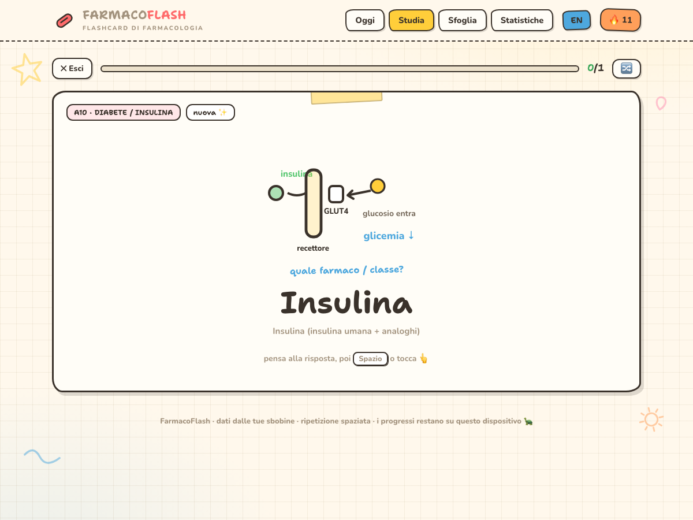

<div align="center">

# 🧬💊 Farmacologia
### Studio integrato — 3D + Flashcard

Esplora i bersagli dei farmaci in **3D** e fissali in memoria con le **flashcard a ripetizione spaziata**. Due strumenti, una sola finestra, una grafica sola.

🇮🇹 **Italiano** · 🇬🇧 [English](README.en.md)


</div>

<p align="center">
  
</p>

---

## ✨ Due strumenti, una finestra

|  | Strumento | A cosa serve |
|:--:|---|---|
| 🧬 | **Bersagli & Farmaci in 3D** | Canali e recettori in **modelli 3D ruotabili**, i **farmaci** per ogni bersaglio, **animazioni** dei meccanismi e **62 classificazioni** d'esame con linee guida aggiornate. |
| 📇 | **FarmacoFlash** | **214 flashcard** a ripetizione spaziata, ognuna con un **approfondimento verificato** (*Goodman & Gilman 14ª ed.* + PubMed). |

Passi dall'una all'altra con le **linguette in alto**; da un farmaco nel 3D **salti alla sua flashcard** in un clic. Tema chiaro/scuro e IT/EN valgono per entrambe.

---

## 🚀 Come iniziare (dopo aver scaricato la repo)

Niente da installare: sono pagine web che si aprono nel browser.

1. **Scarica** — pulsante verde **`Code → Download ZIP`** (o `git clone`).
2. **Estrai** lo ZIP.
3. **Apri `index.html`** con un doppio clic. Fatto. ✦

> [!TIP]
> Tieni tutti i file **nella stessa cartella**: `index.html` carica gli altri.
> Il **3D** e i **caratteri** si scaricano da internet al primo avvio; le **flashcard funzionano offline**.

<details>
<summary><b>🧬 Cosa c'è nell'esploratore 3D</b></summary>

- **Esploratore** per famiglia (voltaggio‑dipendenti, nicotinici, glutammato, GPCR…): tocca un bersaglio → **modello 3D a 360°**, descrizione e farmaci.
- **Animazioni dei meccanismi**, **tabella comparativa**, **liganti Gs/Gi/Gq**, **interazioni CYP450**, mappa **antibiotici**.
- **62 classificazioni** espandibili con **linee guida** (📋) e punti‑chiave (★).
</details>

<details>
<summary><b>📇 Come si usano le flashcard</b></summary>

1. **▶ Inizia** dalla schermata **Oggi**: compare un farmaco, pensa la risposta.
2. **Gira la card** e **valuta** (😖 / 😐 / 😄 / 🌟): l'app la ripropone al momento giusto (ripetizione spaziata stile Anki).
3. **Sfoglia & cerca** per nome, meccanismo o effetto; **📋 Tabella dei nomi** per memorizzarli; **Statistiche** per i progressi.
4. **⬇ Esporta backup** per spostare i dati su un altro dispositivo.
</details>

<details>
<summary><b>📲 Installa come app sul telefono (offline)</b></summary>

- **iPhone:** apri in **Safari** → **Condividi** → **Aggiungi a Home**.
- **Android / Chrome:** menù **⋮** → **Installa app**.
</details>

---

## 🖼️ Anteprima

| Oggi | Studio | Statistiche |
|:--:|:--:|:--:|
|  |  |  |

---

## 📁 Struttura

```
index.html                    ← APRI QUESTO · home con le due app
Canali-e-Recettori-3D.html    ← Bersagli & Farmaci in 3D
Flashcard-Farmacologia.html   ← FarmacoFlash (single‑file, offline, installabile)
Tabella-Farmaci.html          ← tabella dei nomi
screenshots/ · build/         ← immagini · sorgenti e script
```

## 🔒 Privacy
I dati di studio restano **solo nel tuo browser** (nessun server, nessun account). Spostali con **Esporta/Importa backup**.

## 🛠️ Sviluppatori
```bash
node build/build.js          # → Flashcard-Farmacologia.html
node build/_gen-table.js     # → Tabella-Farmaci.html
```

## ⚠️ Note
Materiale a **uso personale di studio**: gli approfondimenti sono sintesi (citano *Goodman & Gilman 14ª ed.* + PubMed) e **non** sostituiscono il libro né il giudizio clinico.

<div align="center"><sub>Strumento di studio · non è supporto decisionale clinico</sub></div>
